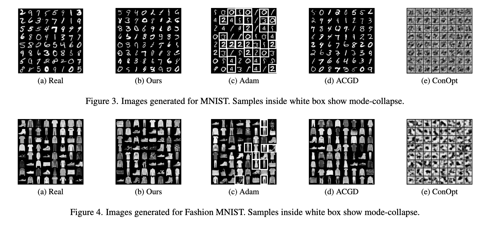
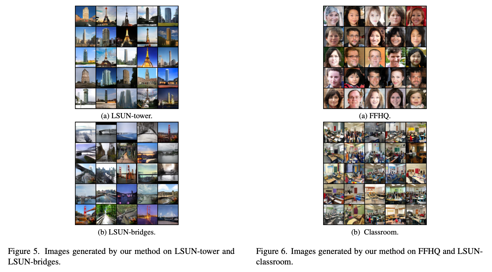

# A Gauss-Newton Approach for Min-Max Optimization in Generative Adversarial Networks

This is the code for the paper "A Gauss-Newton Approach for Min-Max Optimization in Generative Adversarial Networks".

## File Hierarchy

```txt
.
├── code/
│   ├── CIFAR/
│   │   ├── output1/
│   │   ├── output2/
│   │   ├── output3/
│   │   ├── output4/
│   │   └── main2.py
│   ├── LSUN/
│   │   ├── output3/
│   │   └── main3.py
│   ├── MNIST:FMNIST/
│   │   ├── output1/
│   │   ├── output2/
│   │   ├── output3/
│   │   ├── output4/
│   │   ├── fmnist.py
│   │   └── mnist.py
│   └── requirements.txt
└── readme.md
```

## Installation

> **Note**: Use python 3.8.15

1. `cd` into the code directory. 

2. To install dependencies for this repository do: `pip install -r requirements.txt`. 

## Usage 

One can modify hyperparameters and change the dataset path in the script as per requirements.

Every named folder in the `code` directory has a main file dedicated to that dataset, execute this file to train our method on the respective dataset.

### Hyperparameter

The hyperparameters can be modified directly in the main files. Take the `/CIFAR/main2.py` as an example, where you will find the following code snippet. 

```python
# Hyperparameters of the optimizer
lr = 1e-5
lam = 1e-2
# Batch size during training
batchsize = 64
# The gradient penalty hyperparameter
gp_lam = 1
```

## Datasets

We have used CIFAR10, MNIST, Fashion-MNIST, and LSUN datasets.

## Results

The generated images using our proposed method for MNIST and Fashion-MNIST datasets are shown below. To train and generate images for MNIST, use the `/MNIST:FMNIST/mnist.py` file. For Fashion-MNIST, use the `/MNIST:FMNIST/fmnist.py` file.



To train our method on LSUN datasets, you can run the `/LSUN/main3.py file`. This will facilitate training on LSUN-tower, LSUN-bridges, FFHQ, and LSUN-Classroom datasets. Here are some samples generated by our algorithm for each dataset:


